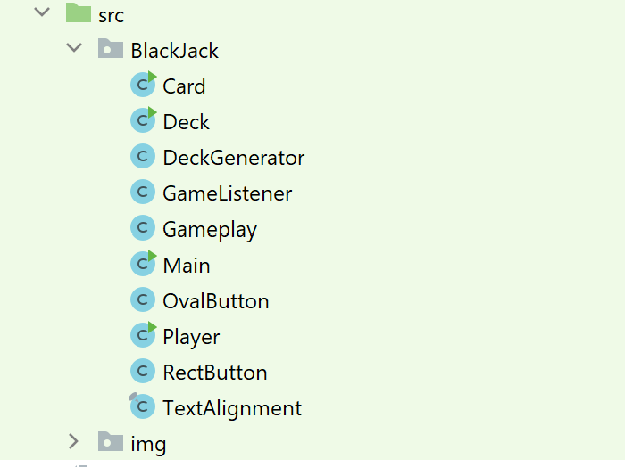
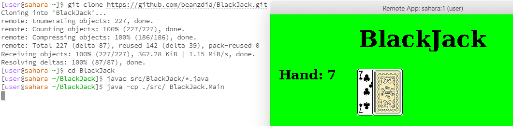

**Note:** installation of programs and Git command lines may be different depending on your operating system, this user guide supplements a **Windows OS**.

To run this program, users should first have at least **Java JDK version 15.0.1** installed on their device; because this game was run with the most recent JDK version, prior versions will not allow our game to run. 

Users should also have their preferred development environment installed; our team mainly uses IntelliJ, however JGrasp works just as well. 

Once the correct version of JDK is installed or updated, users can then clone the Github repository to their computer, meaning they can make a copy of the online files and store them locally. To accomplish this, users must also have Git Bash installed. 

To clone a repository, open Git Bash, navigate to the folder you want to store our repository in (i.e. Documents), and type: 

`git clone https://github.com/beanzdia/BlackJack.git`
    
From there, our repository should be stored on your computer! You can then open your File Explorer, navigate to our ‘BlackJack’ repository, open the ‘src’ folder, open ‘BlackJack’ again, and from there, you should see our collection of .java files. 

Your folder tree should look something like:
> (ex.Documents) > BlackJack > src > BlackJack > ...

Now, if you open **Main.java** in your dev environment (we recommend IntelliJ), compile, and run it, a separate window with a green background and the title “BlackJack” across the top should appear. 

If not, here are some troubleshooting steps you can take:
- Make sure the JRE is running the latest version of Java version 15.0.1
- Make sure all of the files and dependencies are present i.e. all of the classes, the img folder, etc.

The img folder should have 54 images where two are the game's icon, `icon.png`, and the back of a card, `down.jpg`. The remaining 52 cards are named after their suit and rank such as `club_ace.jpg`, `diamond_ten.jpg`, and `spade_king.jpg`. Ensure that there are four suits (diamond, club, spade, and heart). Each suit should have a card from 2-10, king, queen, jack, and ace. All files must follow the naming convention as indicated in the examples.

Opening in an Ed workspace is not recommended because we noticed that the graphics became distored in the window panel. The steps to open in Ed follow as:
- Open the terminal then type and enter `git clone https://github.com/beanzdia/BlackJack.git`.
- Type in the directory `cd BlackJack` and hit enter. Entering the `ls` command should show `DESIGN.md  folderTree.png  README.md  reflection.txt  src`. If unsure about your location, keep entering `cd -` to return to the root directory and try again.
- When in the correct directory, type in the terminal `javac src/BlackJack/*.java` and hit enter.
- Now, type in the terminal `java -cp ./src/ BlackJack.Main`.
- A panel with the game should open now.

Once that window is up and running, you are now able to play a game of BlackJack! We will show more of the user flow in the video itself, but here are some of the main rules on how to play:
- Both the player (you) and the dealer (NPC) will have a hand of cards; the goal of BlackJack is to beat the dealer's hand without going over 21.
- The dealer starts with two cards where the second is hidden until the end of the round.
- All face cards (Jack, Queen, King) are worth 10 and aces can be worth 1 or 11.
- Click on the bid buttons listed with $1, $10, $100, and $1000 and keeping incrementing your bid until you're happy.
- Click on the red bid button to finalize your bid.
- To 'Hit' is to ask for another card. To 'Hold’' is to hold your total and end your turn. The player is able to keep hitting until they get a number that is close to or equals 21. The player may also hold their total and compare it to the dealer’s total at the end of the round. The player can also "bust" which is to go over 21, which results in losing your bid. Winning your hand results in keeping your bid and earning a payout equivalent to your bid. A 'Push' occurs when the hand value for the player and dealer is the same. In this case, the bid is return to the player.
- The end of the turn will generate a message determing the hands result and prompt you to click on the white box with text saying "Click here to continue". Click on the white box to continue playing.
- The player starts with $2500 in funds, and is able to make wagers each round they play by pressing the “bid” button. They can also double their bid when they have at least two cards in their hand.
- The game will continue playing until the user loses all of their funds to the dealer. The user can also exit out of the game by clicking on the "X" exit button on the window toolbar. The window is also not resizable.

#### Edge cases:
- When a player gets an Ace card, the player can choose a value of 1 or 11 for that card from a pop-up menu; the value is up to the discretion of the player. The user just has to click on either the 1 or 11 button in the pop-up graphic.
- When a player acquires a double (e.g. A pair of Sevens), they can choose whether to split that hand or not. If accepted by clicking yes, the player will be able to split the pair into two hands, meaning they have two hands to play with simultaneously. However, they must place a bet equivalent to their first hand in order to split. Make sure to finish your turn on the left hand such as holding or busting after clicking on the hit button before hitting on the second hand. It has to be sequential in order to handle the split hand. There are multiple outcomes such as winning/losing both hands and also pushing on one and winning/losing on the other hand.

Here is a link to our BlackJack Demo:
https://www.youtube.com/watch?v=VML12vGq2GI
